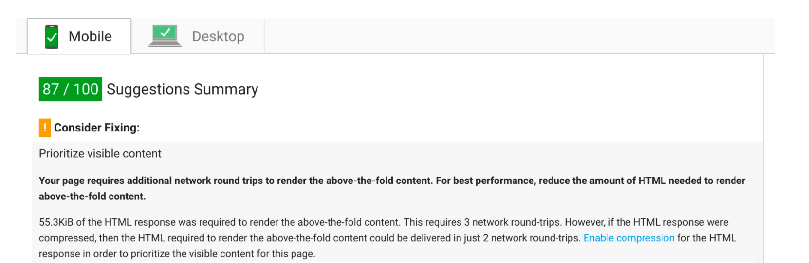
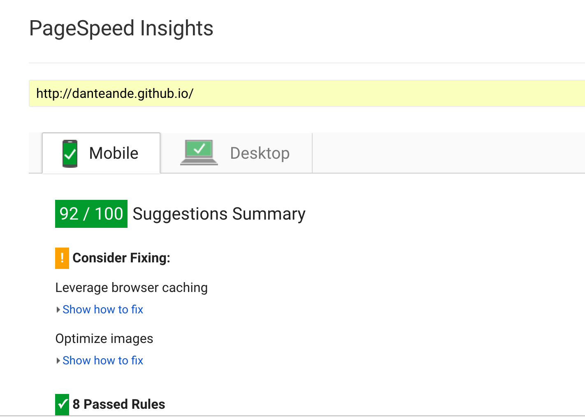
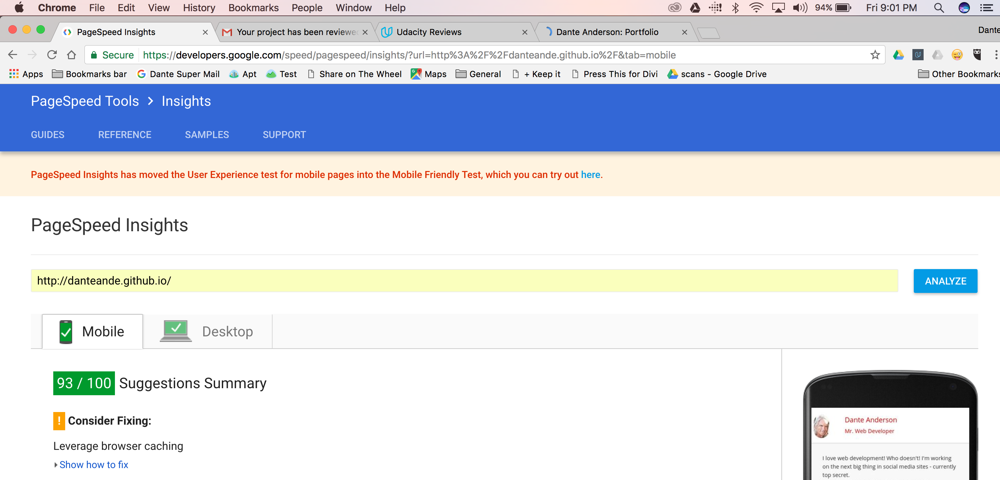
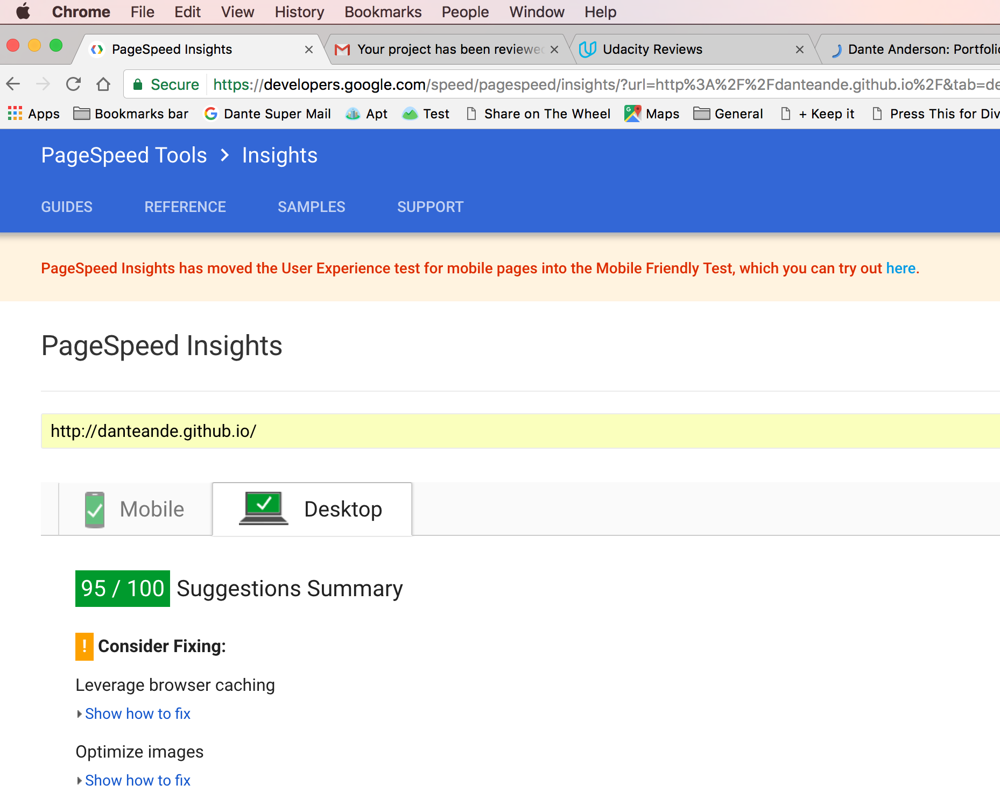

## Website Performance Optimization portfolio project

##### Project Overview FEND Project 4 - Udacity

Your challenge, if you wish to accept it (and we sure hope you will), is to optimize this online portfolio for speed! In particular, optimize the critical rendering path and make this page render as quickly as possible by applying the techniques you've picked up in the [Critical Rendering Path course](https://www.udacity.com/course/ud884).

### This repository is my submission for the above project

## Getting Started

#### Live Version

1. https://danteande.github.io/
1. You can run dev tools to see the code and performance metrics: For Chrome Dev tools on a Mac hit option-command-J

#### Local Version

1. Clone this repository
1. Run a local server with python SimpleHTTPServer, instructions here: https://docs.python.org/2/library/basehttpserver.html
Warning: This requires some set-up if you are new to it.

#### Using Site

1. You should see the main page of the site if you followed the above instructions. That is index.html in the top-level directory. This page required improvements in page loading speed per the project.
1. Click on the 'Cam's Pizzeria' item in the list to see Part 2 of the project: optimizing the response time and animations on views/js/main.js
1. You can check out the other items on index.html as I have customized the portfolio to a certain extent showing other projects completed for the FEND course.

#### Changes

##### Index.html

1. Original PageSpeed scores were in the 30s/40s for desktop/mobile but now are 92/92.
1. I personalized the site as suggested by the instructors. This includes photos of me and additions of my other FEND projects. I left the 2048 game in as I will definitely take that course AND I thought shortening the list of items would be 'cheating' regarding the page load speed improvement task.
1. I tried to preface all of my comments inline with 'Improvements:' in this and all other changed files.
1. Inlined CSS from css/style.css
1. Code changes for index.html included 'asyncing' scripts, and adding media ( media="print" )tags for scripts
1. Most improvements in speed were from image optimizations using Photoshop. Added 100px width tags as well.
1. Note the inlining of the one image, that seems to have lots of practical applications when you need to 'snag' a photo out in the wild - though it is a royal pain to have the data chunk in the middle of the code. Next time, it would be good to add a js file that holds those.

##### views/js/main.js

1. Generally:
1. Most speed improvements came form fixing these 2 things: The slider was layout thrashing by running style in a loop after a (overly-complicated) calculation using a layout parameter. The pizza animations basically had the same problem as the slider so I simplified that code to get the layout parameter outside of the loop to remove the thrashing, i.e. Forced Synchronous Layout.
1. I added 'use strict' on any function I touched. I love this. JS is impossible to understand because it is so flaky IMHO. And throughout replaced all instances of querySelectorAll with getElementById/getElementsByClassName because it is more efficient.
1. Specifically:
1. For the resizer slider code, I moved the math outside of loop as it was running style after layout creating extensive layout thrashing and I created a variable for the loop end condition inside the definition of the for loop  so it is not calculated every iteration.
1. For the randomPizzas for loop, moved pizzasDiv definition to outside of loop so it is defined only once.
1. For the scrolling animation I am dynamically calculating pizzas needed by dividing screen height (window.innerHeight) by height of pizza element for rows and then multiplying by columns. Also added var elem to for loop definition to prevent its creation every iteration. And moved movingpizzas variable definition to outside loop and used getElementById (faster) for movingPizzas1.
1. Determined to use requestAnimationFrame  :) for updatePositions, I had to research some tricks to get the method to stop when scrolling stops. see Selected Resources item 8 below for more details.

##### views/css/style.css

1. Added transform and backface visibility parameters to improve performance to mover class.

##### PageSpeed Notes

1. My original project scored 92/92 mobile/desktop. This was fine with the 1st review.
1. The 2nd reviewer showed my results as 87/90. Needless to say I was a little shocked:

  
1. Scores after 2nd Review but before any changes

  
1. Current scores

  

##### Selected Resources

1. Pagespeed: https://developers.google.com/speed/pagespeed/insights/?url=http%3A%2F%2Fdanteande.github.io%2F&tab=desktop
1. Base64 image optimizer: https://www.base64-image.de/
1. Math() function: https://developer.mozilla.org/en-US/docs/Web/JavaScript/Reference/Global_Objects/Math/ceil
1. style.top property: https://www.w3schools.com/jsref/prop_style_top.asp
1. window innerHeight property: https://www.w3schools.com/jsref/prop_win_innerheight.asp
1. backface-visibility property: https://developer.mozilla.org/en-US/docs/Web/CSS/backface-visibility
1. requestAnimationFrame method: https://developer.mozilla.org/en-US/docs/Web/API/window/requestAnimationFrame
1. Adding requestAnimationFrame to scrolling: https://www.html5rocks.com/en/tutorials/speed/animations/
1. Scroll event: https://www.w3schools.com/jsref/event_onscroll.asp
